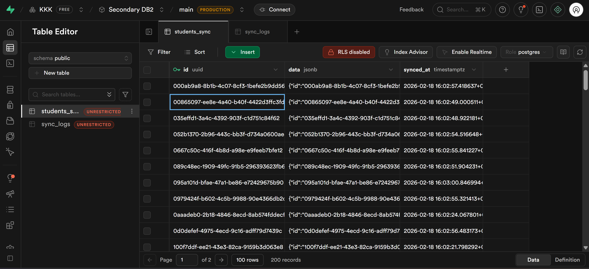
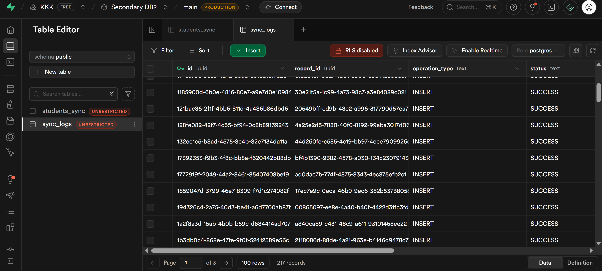

Project 2: Data Sync Engine
A serverless data pipeline that synchronizes student records from a primary relational database to a secondary JSONB-based audit database.

Architecture Overview:
Trigger: Supabase DB1 sends a webhook notification on every record change.
Buffer: A Cloudflare Queue holds the data to prevent the system from crashing during spikes.
Processor: A Cloudflare Worker transforms the data from flat rows into a nested JSONB object.
Storage: The transformed data is saved into Supabase DB2 with a detailed sync log.

Setup Instructions:

1. Database Configuration
   DB1 (Source): Create a table named students with columns: id, fname, lname, email.
   DB2 (Target): Create a table named students_sync with columns: id (UUID) and data (JSONB).
   Audit Table: Create a table named sync_logs in DB2 to track performance.

2. Worker Deployment
   Configure Env: Set your Supabase URLs and Service Role Keys
   This project uses encrypted Cloudflare Secrets for database security. To configure the project, run:
   npx wrangler secret put SUPABASE_URL_DB1
   npx wrangler secret put SUPABASE_KEY_DB1
   npx wrangler secret put SUPABASE_URL_DB2
   npx wrangler secret put SUPABASE_KEY_DB2

Installation & Deployment: Install dependencies
npm install

Queue Setup: Create a queue in your Cloudflare dashboard named cl_queue.
Deploy: npx wrangler deploy

Screenshots:

1. The Sync Engine
   This screenshot shows the successful transformation of relational data into a flexible JSONB format within the target database.
   
   

Features:
Real-time Sync: Triggered instantly via database webhooks.
Backfill Job: Endpoint for bulk migration of existing records.
Retry Logic: Exponential backoff for maximum reliability.
